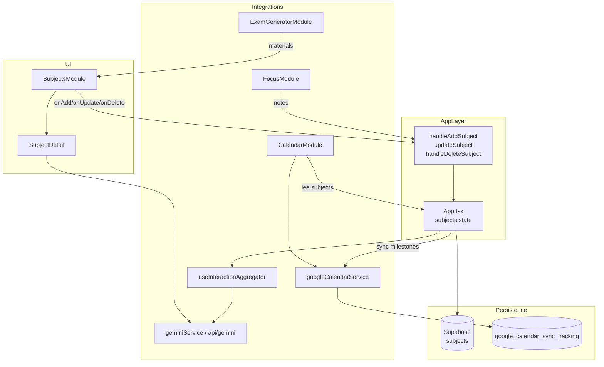

# Asignaturas — Guía completa del módulo

Documentación del módulo **Asignaturas** (*Laboratorio de Saberes*) en Studianta: qué hace, cómo está armado por dentro, flujos paso a paso e integraciones con el resto de la app.

---

## Índice

1. [Visión general](#1-visión-general)
2. [Arquitectura y archivos clave](#2-arquitectura-y-archivos-clave)
3. [Modelo de datos](#3-modelo-de-datos)
4. [Persistencia en Supabase](#4-persistencia-en-supabase)
5. [Interfaz de usuario](#5-interfaz-de-usuario)
6. [Workflows paso a paso](#6-workflows-paso-a-paso)
7. [Pestañas del detalle de asignatura](#7-pestañas-del-detalle-de-asignatura)
8. [Integraciones con otros módulos](#8-integraciones-con-otros-módulos)
9. [Contexto para IA (SPC)](#9-contexto-para-ia-spc)
10. [Sincronización con calendario](#10-sincronización-con-calendario)
11. [Exportaciones PDF](#11-exportaciones-pdf)
12. [Navegación y acceso](#12-navegación-y-acceso)
13. [Limitaciones y detalles técnicos](#13-limitaciones-y-detalles-técnicos)

---

## 1. Visión general

**Asignaturas** es el núcleo académico de Studianta. Permite al estudiante:

- Registrar materias con datos de cátedra, cuatrimestre y estado académico.
- Definir **hitos** (exámenes, parciales, entregas, TPs) y **horarios de cursada**.
- Tomar **apuntes** enriquecidos (HTML, fragmentos importantes, sellado simbólico).
- Subir **materiales** (programa oficial + contenidos de estudio).
- Consultar al **Mentor IA (Oráculo académico)** con contexto de la materia.
- Generar un **dossier PDF** con toda la información consolidada.

Los datos viven en el estado global de `App.tsx`, se persisten en Supabase (tabla `subjects`) y alimentan Calendario, Enfoque, Exámenes IA, Dashboard Stats y el Oráculo general.

---

## 2. Arquitectura y archivos clave

```
App.tsx                          ← Estado global `subjects[]`, handlers CRUD, sync Google
    │
    ├── SubjectsModule.tsx       ← UI principal (lista + detalle + modales)
    │       ├── SubjectDetail    ← Vista fullscreen con 4 pestañas
    │       └── NoteEditorModal  ← Editor rich-text de apuntes
    │
    ├── CalendarModule.tsx       ← Clases, hitos, .ics, Google Calendar
    ├── FocusModule.tsx          ← Pomodoro → apuntes "Cosecha de Enfoque"
    ├── ExamGeneratorModule.tsx  ← Exámenes IA desde materiales PDF
    ├── OraculoPage.tsx          ← Oráculo global con contexto académico
    ├── DashboardStatsModule.tsx ← Métricas derivadas de asignaturas
    │
    ├── supabaseService.ts       ← getSubjects / createSubject / updateSubject / deleteSubject
    ├── googleCalendarService.ts ← syncMilestone, syncEvents, deleteSyncedEvent
    ├── geminiService.ts         ← queryAcademicOracle
    ├── useInteractionAggregator.ts ← StudentProfileContext (SPC)
    └── types.ts                 ← Subject, Milestone, Schedule, Note, StudyMaterial
```

| Archivo | Ruta absoluta |
|---------|---------------|
| Componente principal | `components/SubjectsModule.tsx` |
| Tipos | `types.ts` |
| CRUD Supabase | `services/supabaseService.ts` (sección `SUBJECTS`) |
| Orquestación | `App.tsx` |
| Constantes del módulo | `constants.tsx` → `INITIAL_MODULES[0]` (`id: 'subjects'`) |
| Documentación en app | `components/DocsPage.tsx` → `SubjectsSection` |
| Copia legacy (no usada) | `hooks/components/SubjectsModule.tsx` |

> **Fuente de verdad:** `components/SubjectsModule.tsx`. La copia en `hooks/components/` es una versión antigua que **no** importa `App.tsx`.

---

## 3. Modelo de datos

Todo el contenido anidado de una asignatura (hitos, horarios, apuntes, materiales) se guarda como **JSON embebido** en una sola fila de la tabla `subjects`. No hay tablas hijas normalizadas.

### `Subject` — Asignatura principal

| Campo TS | Tipo | Editable en UI | Descripción |
|----------|------|----------------|-------------|
| `id` | `string` | No | UUID generado por Supabase |
| `name` | `string` | Solo al crear | Nombre de la materia |
| `career` | `string` | Solo al crear | Carrera o plan de estudios |
| `professor` | `string?` | Sí (Cátedra) | Docente |
| `email` | `string?` | Sí (Cátedra) | Contacto del profesor |
| `aula` | `string?` | Sí (Cátedra) | Aula de cursada |
| `phone` | `string?` | **No** | En modelo/DB, sin UI |
| `room` | `string?` | **No** | Usado como fallback en Calendario |
| `status` | `SubjectStatus` | Sí | `'Cursando' \| 'Final Pendiente' \| 'Aprobada'` |
| `absences` | `number` | **No** | Default `0` al crear |
| `maxAbsences` | `number` | **No** | Default `20` al crear |
| `grade` | `number?` | Sí (al aprobar) | Nota final numérica |
| `termStart` / `termEnd` | `string?` | Sí (Cátedra) | Fechas del cuatrimestre (ISO) |
| `milestones` | `Milestone[]` | Sí (Horarios) | Hitos académicos |
| `schedules` | `Schedule[]` | Sí (Horarios) | Horarios semanales |
| `notes` | `Note[]` | Sí (Apuntes) | Apuntes de clase |
| `materials` | `StudyMaterial[]` | Sí (Cátedra) | Archivos de estudio |

### `Milestone` — Hito académico

| Campo | Valores / notas |
|-------|-----------------|
| `id` | Generado localmente (`Math.random().toString(36)`) |
| `title` | Título libre |
| `date` | Fecha (`type="date"`) |
| `time` | Opcional en el tipo; **el modal de creación no incluye hora** |
| `type` | `'Examen' \| 'Parcial' \| 'Entrega' \| 'Trabajo Práctico'` |

### `Schedule` — Horario de cursada

| Campo | Valores / notas |
|-------|-----------------|
| `id` | Generado localmente |
| `day` | Lunes – Sábado |
| `startTime` / `endTime` | Inputs `type="time"` |

### `Note` — Apunte

| Campo | Descripción |
|-------|-------------|
| `id`, `title`, `date` | Metadatos básicos |
| `content` | HTML del editor rich-text |
| `importantFragments` | Fragmentos de texto marcados como importantes |
| `isSealed` | Flag de "nota sellada" (marca simbólica para el Oráculo) |

### `StudyMaterial` — Material de estudio

| Campo | Descripción |
|-------|-------------|
| `name`, `date`, `type` | Nombre, fecha de subida, tipo inferido del MIME |
| `type` | `'Syllabus' \| 'Apunte' \| 'Pizarrón' \| 'PDF' \| 'Word' \| 'PPT'` |
| `content` | **Base64 data URL** (implementación actual) |
| `fileUrl` | Preparado para Supabase Storage; **no usado** al subir desde Asignaturas |
| `category` | `'programa'` (uno solo, reemplazable) o `'contenido'` (múltiples) |

---

## 4. Persistencia en Supabase

### Tabla `subjects`

Columnas inferidas del servicio (`supabaseService.ts`):

```
id, user_id, name, career, professor, email, phone, room, aula,
status, absences, max_absences, grade, term_start, term_end,
milestones (jsonb), schedules (jsonb), notes (jsonb), materials (jsonb),
created_at
```

### Métodos CRUD

| Método | Qué hace |
|--------|----------|
| `getSubjects(userId)` | `SELECT *` filtrado por `user_id`, orden `created_at DESC`. Mapea snake_case → camelCase. Si la tabla no existe → `[]`. |
| `createSubject(userId, subject)` | `INSERT` con todos los campos. Retorna fila mapeada. |
| `updateSubject(userId, subjectId, updates)` | `UPDATE` parcial campo a campo. Filtro `id` + `user_id`. |
| `deleteSubject(userId, subjectId)` | `DELETE` con mismo filtro. |

### Encriptación

Los datos de asignaturas **no** pasan por `encryptionService`. La encriptación E2E de Studianta aplica a diario, eventos personalizados del calendario, transacciones Balanza Pro y PIN de seguridad — **no** a notas ni materiales de asignaturas.

### Carga inicial

Tras el login, `App.tsx` carga las asignaturas junto con el resto de datos del usuario:

```
supabaseService.getSubjects(userId) → setSubjects(data)
```

---

## 5. Interfaz de usuario

### Vista lista — `SubjectsModule`

- **Título:** "Laboratorio de Saberes"
- **Botón principal:** "Inaugurar Asignatura" → modal de creación
- **Grid de tarjetas:** una por asignatura, con badge de estado y borde de color según status
  - `Cursando` → borde rosa (`#E35B8F`)
  - `Aprobada` → borde dorado (`#D4AF37`)
- **Acciones en tarjeta:**
  - Click → abre detalle fullscreen
  - Icono papelera → confirmación de borrado

### Vista detalle — `SubjectDetail`

Pantalla completa con:

- **Header:** nombre, carrera, selector de estado, botón "Dossier" (PDF), botón cerrar
- **4 pestañas:** Cátedra · Horarios · Apuntes · Mentor IA
- **Modales internos:** hitos, horarios, apuntes, PDF viewer, celebración de aprobación

---

## 6. Workflows paso a paso

### 6.1 Crear una asignatura

```
Usuario → Dashboard o Nav → "Asignaturas"
       → Click "Inaugurar Asignatura"
       → Modal: nombre + carrera (requeridos)
       → Submit
       → App.handleAddSubject(name, career)
       → supabaseService.createSubject() con defaults:
            status: 'Cursando'
            absences: 0, maxAbsences: 20
            milestones/schedules/notes/materials: []
       → setSubjects([...subjects, created])
       → Nueva tarjeta visible en el grid
```

### 6.2 Abrir y editar una asignatura

```
Usuario → Click en tarjeta
       → SubjectDetail fullscreen (pestaña Cátedra por defecto)
       → Ediciones inline (profesor, email, aula, fechas cuatrimestre)
       → Cada cambio llama onUpdate(subject)
       → App.updateSubject(updated)
            1. Actualización optimista en estado local
            2. supabaseService.updateSubject()
            3. Si Google Calendar conectado → sync automático de milestones
       → Datos persistidos en Supabase
```

> **Nota:** `name` y `career` **no** son editables después de la creación.

### 6.3 Cambiar estado y registrar nota final

```
Usuario → Selector de estado en header del detalle
       → Si elige "Aprobada":
            Modal "¡TRIUNFO!" pide nota numérica
            → submitFinalGrade()
            → onUpdate({ ...subject, status: 'Aprobada', grade: parseFloat(nota) })
       → Si elige otro estado (Cursando / Final Pendiente):
            → onUpdate({ ...subject, status }) directamente
```

### 6.4 Eliminar una asignatura

```
Usuario → Icono papelera en tarjeta (sin abrir detalle)
       → Modal "¿Borrar Asignatura?"
       → Confirmar
       → App.handleDeleteSubject(id)
            1. Remove optimista del estado local
            2. supabaseService.deleteSubject()
       → Si el detalle estaba abierto para esa materia → se cierra
```

> Al borrar una asignatura **no** se limpian automáticamente las entradas en `google_calendar_sync_tracking`.

### 6.5 Crear un hito (milestone)

```
Usuario → Detalle → pestaña "Horarios"
       → Sección "Cronograma de exámenes y otras fechas" → botón +
       → Modal: título, fecha, tipo (Examen/Parcial/Entrega/TP)
       → Submit → append al array milestones → onUpdate()
       → Si Google Calendar conectado → syncMilestone() automático
       → Hito visible en Calendario y export .ics
```

### 6.6 Crear un horario de cursada

```
Usuario → Detalle → pestaña "Horarios"
       → Sección "Horarios de cursada" → botón +
       → Modal: día (L–S), hora inicio, hora fin
       → Submit → append a schedules → onUpdate()
       → Calendario genera clases recurrentes entre termStart y termEnd
```

### 6.7 Subir materiales

```
Programa (uno solo, reemplazable):
  Cátedra → "Programa oficial" → input file
  → FileReader.readAsDataURL()
  → StudyMaterial { category: 'programa', content: base64 }
  → Si ya existía programa → reemplaza el anterior

Contenidos (múltiples):
  Cátedra → "Contenidos de asignatura" → input file
  → append al array materials con category: 'contenido'

Ver / descargar:
  → Click en material PDF → modal iframe
  → Botón descarga → <a download> con data URL
```

### 6.8 Gestionar apuntes

```
Crear:
  Apuntes → "Nueva Clase" → NoteEditorModal
  → Editor rich-text (H1–H3, negrita, itálica, listas, citas)
  → Guardar → append a notes → onUpdate()

Editar / eliminar:
  → Click en apunte existente → NoteEditorModal
  → Guardar cambios o eliminar

Fragmentos importantes:
  → Seleccionar texto → marcar como importante
  → Se guarda en importantFragments[]

Sellar nota:
  → Botón "Sellar Nota" → isSealed: true
  → Marca simbólica (no cifrado); visible en UI y en SPC para IA

Filtrar:
  → Búsqueda por texto + toggle "Solo importantes"
```

### 6.9 Consultar al Mentor IA

```
Usuario → Detalle → pestaña "Mentor IA"
       → Seleccionar materiales y/o apuntes como contexto (checkboxes)
       → Escribir pregunta → Submit
       → geminiService.queryAcademicOracle(
            subject.name, query, contextStr, studentProfileContext
          )
       → Respuesta renderizada con OracleTextRenderer
       → Opcional: exportar chat a PDF con sello visual

Al cerrar el detalle:
  → Si hay chat sin descargar → advertencia (handleCloseWithCheck)
```

### 6.10 Generar dossier PDF

```
Usuario → Detalle → botón "Dossier" en header
       → downloadDossier()
       → jsPDF con: cátedra, horarios, milestones, apuntes, nota final
       → addSealToPDF() agrega imagen /seal.png (sello visual, no cifrado)
```

---

## 7. Pestañas del detalle de asignatura

| ID interno | Nombre UI | Contenido |
|------------|-----------|-----------|
| `info` | **Cátedra** | Profesor, email, aula, fechas cuatrimestre, programa, contenidos |
| `plan` | **Horarios** | Milestones + schedules de cursada |
| `notas` | **Apuntes** | Timeline de notas, búsqueda, filtro importantes, editor |
| `lab` | **Mentor IA** | Chat contextual con Gemini, selector de materiales/apuntes |

---

## 8. Integraciones con otros módulos

### Calendario (`CalendarModule.tsx`)

| Dato de asignatura | Cómo aparece en calendario |
|--------------------|----------------------------|
| `schedules` | Clases recurrentes por día de semana, dentro de `termStart`–`termEnd` |
| `milestones` | Eventos tipo `milestone`; prioridad alta si faltan ≤48h |
| Export `.ics` | Incluye clases e hitos |
| Google Calendar | Sync manual (botón) o automático al actualizar milestones |

Subtítulo de clases en calendario usa `subject.room` (no `aula`) — posible inconsistencia visual si solo se completó `aula`.

### Enfoque (`FocusModule.tsx`)

Al terminar una sesión Pomodoro con reflexión:

1. Crea un `Note` titulado **"Cosecha de Enfoque"** en la asignatura seleccionada.
2. Opcionalmente crea un evento en el calendario personal (`CustomCalendarEvent`) si `showFocusAnnotations` está activo.

```
FocusModule → onUpdateSubject({ ...subject, notes: [newNote, ...notes] })
```

### Generador de exámenes (`ExamGeneratorModule.tsx`)

- Selector de asignatura desde `subjects[]`.
- Materiales disponibles: PDFs/contenidos de `subject.materials`.
- `examService` extrae texto de PDFs (base64 o `fileUrl` si existiera).

### Oráculo global (`OraculoPage.tsx`)

Recibe `subjects` vía props. El hook `useInteractionAggregator` construye el **Student Profile Context (SPC)** con resumen académico, deadlines y notas selladas para enriquecer respuestas de IA.

### Dashboard Stats (`DashboardStatsModule.tsx`)

Métricas desde `academic_summary`:

- `active_subjects_count` — materias en estado `Cursando`
- `upcoming_deadlines` — hitos en los próximos 30 días
- `next_critical_date` — fecha del hito más próximo
- `total_milestones` — total de hitos registrados

Click en alertas → navega a `NavView.SUBJECTS`.

### Alertas del dashboard (`utils/dashboardAlerts.ts`)

- **"Sin asignaturas activas"** si `active_subjects_count === 0`.
- Deadlines y fechas críticas derivadas de milestones en los próximos 30 días.

---

## 9. Contexto para IA (SPC)

El hook `useInteractionAggregator` transforma cada `Subject` al formato snake_case del SPC:

```typescript
{
  id, name, career, status, grade, professor, email, aula,
  term_start, term_end,
  milestones: [{ id, title, date, time, type }],
  schedules: [{ id, day, start_time, end_time }],
  notes: [{ id, title, content, date, important_fragments, is_sealed }]
}
```

Y calcula `academic_summary`:

```typescript
{
  active_subjects_count,   // status === 'Cursando'
  upcoming_deadlines,      // milestones en próximos 30 días
  next_critical_date,      // fecha del hito más cercano
  total_milestones
}
```

Este contexto se envía a:

- `geminiService.queryAcademicOracle()` (Mentor IA por materia)
- `/api/gemini.js` (Oráculo global y otros endpoints académicos)
- Dashboard Stats y alertas

---

## 10. Sincronización con calendario

### Automática (al editar asignatura)

En `App.updateSubject()`:

```
Si googleCalendarService.isConnected(userId):
  Para cada milestone en updated.milestones → syncMilestone()
  Para cada milestone eliminado (diff con oldSubject) → deleteSyncedEvent()
```

### Manual (desde Calendario)

```
CalendarModule → botón "Sincronizar con Google"
→ googleCalendarService.syncEvents(userId, subjects, customEvents)
→ Crea/actualiza eventos en calendario "Studianta - Academia"
→ Tracking en tabla google_calendar_sync_tracking
```

### Formato de eventos Google para milestones

- Título: `[Studianta] {type}: {subject.name}`
- Color rojo si tipo `Examen`
- Recordatorios: 24h y 1h antes
- Si el hito tiene `time`, evento con hora; si no, evento de día completo

---

## 11. Exportaciones PDF

| Export | Origen | Contenido | Sello |
|--------|--------|-----------|-------|
| **Dossier** | Botón header del detalle | Cátedra, horarios, hitos, apuntes, nota | `addSealToPDF()` |
| **Chat Mentor IA** | Botón en pestaña lab | Historial de conversación estilizado | `addSealToPDF()` |
| **Exámenes IA** | ExamGeneratorModule | Generado por examService | `addSealToPDF()` |

El sello (`/seal.png`) es un **elemento visual decorativo**, no cifrado ni firma digital.

---

## 12. Navegación y acceso

| Mecanismo | Valor |
|-----------|-------|
| `NavView` | `SUBJECTS = 'Asignaturas'` |
| Módulo en constants | `{ id: 'subjects', name: 'Asignaturas', icon: 'book', active: true }` |
| Posición en nav default | **Order 0** (primera en desktop y mobile) |
| Dashboard | Tarjeta "Asignaturas" → `NavView.SUBJECTS` |
| Docs in-app | `/docs` → sección Asignaturas |

### Props que recibe `SubjectsModule` desde `App.tsx`

```typescript
<SubjectsModule
  subjects={subjects}
  onAdd={handleAddSubject}
  onDelete={handleDeleteSubject}
  onUpdate={updateSubject}
  isMobile={isMobile}
  onMaterialUpload={handleMaterialUpload}  // stub vacío (legacy)
  studentProfileContext={studentProfileContext}
  isNightMode={isNightMode}
/>
```

---

## 13. Limitaciones y detalles técnicos

| Tema | Detalle |
|------|---------|
| **Modelo documento único** | Hitos, horarios, apuntes y materiales viven como JSON en una fila. Sin normalización relacional. |
| **Materiales en base64** | Los archivos se almacenan como data URL dentro del JSON. Puede ser pesado para PDFs grandes. |
| **`fileUrl` sin usar** | El tipo soporta URL de Storage, pero la subida actual siempre usa `content` base64. |
| **Campos sin UI** | `phone`, `room`, `absences`, `maxAbsences` existen en modelo/DB pero no tienen formulario de edición. |
| **`milestone.time`** | Soportado en tipos, Google Calendar e ICS; el modal de creación **no** pide hora. |
| **Auto-guardado de apuntes** | Hay timeout preparado (3s) pero **no persiste** automáticamente (comentado en código). |
| **Borrado optimista** | Si falla la red en create/update/delete, no hay rollback del estado local. |
| **Borrado de asignatura** | No elimina eventos huérfanos en Google Calendar tracking. |
| **`aula` vs `room`** | UI edita `aula`; Calendario muestra `room` en subtítulos de clase. |
| **Encriptación** | Datos de asignaturas **no** encriptados (a diferencia del diario). |
| **Copia legacy** | `hooks/components/SubjectsModule.tsx` obsoleta; no modificar salvo migración explícita. |

---

## Diagrama de flujo de datos



---

## Referencia rápida de handlers en App.tsx

```typescript
// Crear — defaults: Cursando, absences 0, maxAbsences 20, arrays vacíos
handleAddSubject(name, career)
  → supabaseService.createSubject(user.id, newSubject)
  → setSubjects([...subjects, created])

// Actualizar — optimista + Supabase + sync Google milestones
updateSubject(updated)
  → setSubjects(map)
  → supabaseService.updateSubject(user.id, updated.id, updated)
  → googleCalendarService.syncMilestone() / deleteSyncedEvent()

// Eliminar — optimista + Supabase
handleDeleteSubject(id)
  → setSubjects(filter)
  → supabaseService.deleteSubject(user.id, id)
```

---

*Documento generado a partir del código en `studianta/` — última revisión alineada con `components/SubjectsModule.tsx` y `services/supabaseService.ts`.*
